# Stash – Intelligent File Organizer

| Field | Value |
|-------|-------|
| **Full Name** | Kislay Dutta |
| **Intern ID** | CITS4762 |
| **Number of Weeks** | 6 Weeks |
| **Project Name** | Stash – Intelligent File Organizer |
| **Project Scope** | A pure-Python CLI tool that automatically organizes files in any given folder by extension. It scans the target directory, moves files into categorized subfolders (Documents, Images, Music, Videos, Archives, Project, WebPages, Others, etc.), safely renames duplicates with incrementing suffixes, handles unknown extensions, and produces timestamped logs plus a Statistics.json summary. The tool accepts a folder path via command-line argument or interactive prompt, validates the path, and refuses to organize its own source tree. Built with only the Python standard library. |

---

## Project Overview

Stash is a command-line file organizer that brings order to cluttered folders. Point it at any directory and it will sort every file into well-named category subfolders based on its extension — all with zero external dependencies. It is designed to be safe, transparent, and easy to run on any system with Python 3.10+.

## Features

- **68 file extension mappings** across Documents, Images, Videos, Music, Archives, GIFs, Project, WebPages, and Others
- **Safe duplicate handling** — renames duplicates with incrementing suffixes (`file(1).txt`, `file(2).txt`)
- **Unknown file detection** — unmapped extensions go to `Others/Unknown`
- **Timestamped logs** — every move is recorded in `.system/logs/`
- **Statistics tracking** — run stats saved to `.system/stats/Statistics.json`
- **Recursive traversal protection** — organizer never re-processes its own output folders or application internals
- **Self-guard** — refuses to organize its own source tree
- **Flexible input** — accepts target folder via CLI argument or interactive prompt
- **Zero external dependencies** — pure Python stdlib

## Requirements

- Python 3.10+ (tested on 3.14)

## Installation

```bash
git clone <repository-url>
cd FileOrgProject
```

No package installation is required. The project uses only Python standard library modules.

## How to Run

### Via CLI argument

```bash
python main.py "C:\path\to\folder\to\organize"
```

### Via interactive prompt

```bash
python main.py
Enter the full path of the folder to organize: C:\path\to\folder\to\organize
```

### Using the settings fallback

You can also set a default path in `config/settings.py` (last-resort fallback when neither a CLI argument nor interactive input is given):

```python
PROJECT_FOLDER: Path | None = Path(r"C:\path\to\your\folder")
```

## Project Structure

```
FileOrgProject/
├── __init__.py              # Package root
├── main.py                  # Application entry point
├── README.md
├── requirements.txt          # Python 3.10+ requirement
├── config/
│   ├── __init__.py
│   ├── settings.py          # Configuration (paths, skip folders)
│   └── extension_map.py     # 68 extension-to-folder mappings
├── core/
│   ├── __init__.py
│   ├── organizer.py         # Orchestration pipeline
│   ├── scanner.py           # Directory traversal with skip protection
│   ├── mover.py             # Safe file moves with duplicate detection
│   ├── duplicate_handler.py # Incrementing suffix generation
│   ├── folder_manager.py    # System directory creation
│   └── validator.py         # Project folder validation
├── utils/
│   ├── __init__.py
│   ├── logger.py            # Timestamped logging
│   ├── stats.py             # Statistics tracking and JSON persistence
│   ├── path_utils.py        # Path and folder name helpers
│   ├── filename_utils.py    # Filename splitting utilities
│   └── helpers.py           # General helpers
├── tests/
│   ├── __init__.py
│   └── test_integration.py  # 43 integration tests
├── Documents/                # Organized output (auto-created)
├── Others/                   # Organized output (auto-created)
├── .system/                  # Runtime data (auto-created)
│   ├── logs/                 # Timestamped log files
│   └── stats/                # Statistics JSON output
├── screenshots/              # Submission screenshots
└── Legacy/                   # Archived historical versions
    ├── Sift/                # Previous package (same architecture)
    └── Project/Python/      # Original single-file implementations
```

## Extension Mappings

Extension-to-folder mappings are defined in `config/extension_map.py`. The map covers **68 extensions** across **7 categories**:

| Category | Extensions | Target Subfolder |
|----------|-----------|-----------------|
| **Documents** | `.pdf`, `.txt`, `.docx`, `.doc`, `.pptx`, `.xlsx`, `.csv` | `Documents/*` |
| **Images** | `.jpg`, `.jpeg`, `.png` | `Images/*` |
| **GIFs** | `.gif` | `GIFs/` |
| **Videos** | `.mp4`, `.avi`, `.mov`, `.mkv`, `.webm`, `.srt`, `.sub`, `.vtt` | `Videos/*` |
| **Music** | `.mp3`, `.wav`, `.flac`, `.opus`, `.aac`, `.m4a`, `.lrc` | `Music/*` |
| **Archives** | `.zip`, `.rar`, `.7z`, `.tar`, `.gz` | `Archives/*` |
| **Others** | `.py`, `.html`, `.css`, `.js`, `.ts`, `.svg`, `.psd`, `.ai`, `.md`, `.xml`, `.yml`, `.exe`, `.iso`, `.db`, and more | `Project/*`, `WebPages/*`, `Images/*`, `Others/*` |

## Duplicate Handling

When a file with the same name already exists in the target folder, Stash renames the incoming file by appending an incrementing suffix:

- `report.pdf` → `report(1).pdf`
- `report(1).pdf` → `report(2).pdf`

This prevents data loss while keeping all files accessible.

## Logging & Statistics

### Logging

Every run creates a timestamped log file in `.system/logs/` with entries tagged by operation type:

```
[2026-07-22 22:00:08] [MOVED] notes.txt → Documents/Text Files/notes.txt
[2026-07-22 22:00:08] [DUPLICATE] report.pdf → Documents/PDFs/report(1).pdf
[2026-07-22 22:00:08] [UNKNOWN] mystery.xyz → Others/Unknown/mystery.xyz
```

### Statistics

After each run, Stash writes a `Statistics.json` file to `.system/stats/` containing:

- Run Time (ISO timestamp)
- Execution Time (seconds)
- Files Processed
- Files Moved
- Duplicate Files Renamed
- Unknown Files Found
- Category Counts (per-folder breakdown)

## Configuration

All settings live in `config/settings.py`:

- **`PROJECT_FOLDER`** — last-resort fallback default (set to the folder path, or keep `None` to always require a CLI argument or interactive input)
- **`SKIP_FOLDERS`** — directory names the scanner never enters (protects output folders and application internals)
- **`ROOT_SKIP_FILES`** — root-level filenames that are never moved (`main.py`, `__init__.py`, `README.md`, `requirements.txt`)
- **`UNKNOWN_FOLDER`** — target folder for unmapped extensions (`Others/Unknown`)
- **System paths** — `.system/logs`, `.system/stats`, `.system/stats/Statistics.json`

## Architecture

| Module | Responsibility |
|--------|---------------|
| `config/settings.py` | All configurable values (paths, skip folders, system dirs) |
| `config/extension_map.py` | All 68 extension-to-folder mappings, centralized |
| `core/organizer.py` | Orchestrates the scan → move → stats pipeline |
| `core/scanner.py` | Directory traversal with skip-folder and skip-file protection |
| `core/mover.py` | Safe file moves with duplicate detection |
| `core/duplicate_handler.py` | Generates `file(1).ext`, `file(2).ext` naming |
| `core/folder_manager.py` | Creates `.system/logs` and `.system/stats` dirs |
| `core/validator.py` | Validates project folder exists and is accessible |
| `utils/logger.py` | Centralized timestamped logging |
| `utils/stats.py` | Statistics tracking and JSON persistence |
| `utils/path_utils.py` | Relative path and folder name helpers |
| `utils/filename_utils.py` | Filename splitting utilities |
| `utils/helpers.py` | General-purpose helper functions |

## Running Tests

```bash
# Run the full integration test suite (43 tests)
python -m tests.test_integration
python tests/test_integration.py
```

## Screenshots

### Before & After

| Before Organization | After Organization |
|---------------------|--------------------|
| 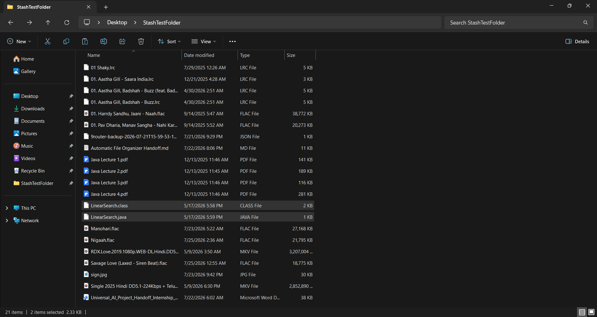 | 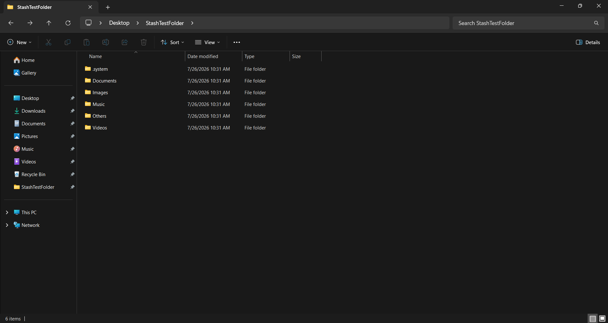 |

### Running the Tool

| Terminal Output — File Move | Organized Folders View |
|-----------------------------|----------------------|
| 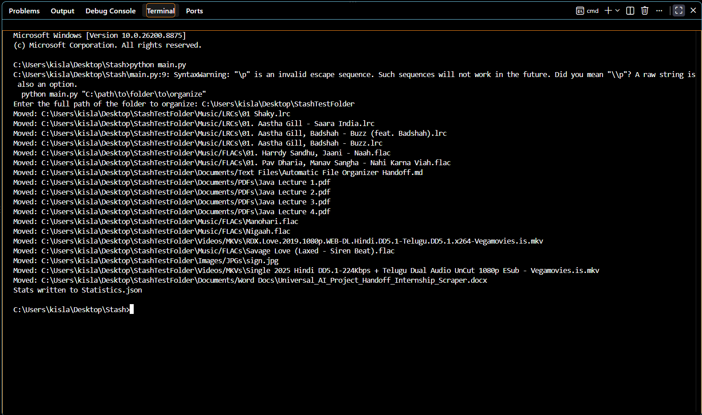 | 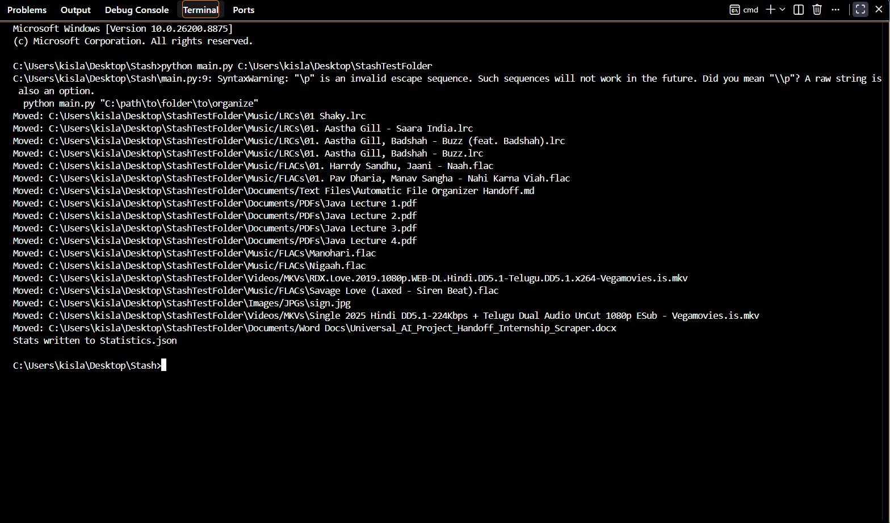 |

### Organized Folders

| Documents | Images | Music |
|-----------|--------|-------|
| 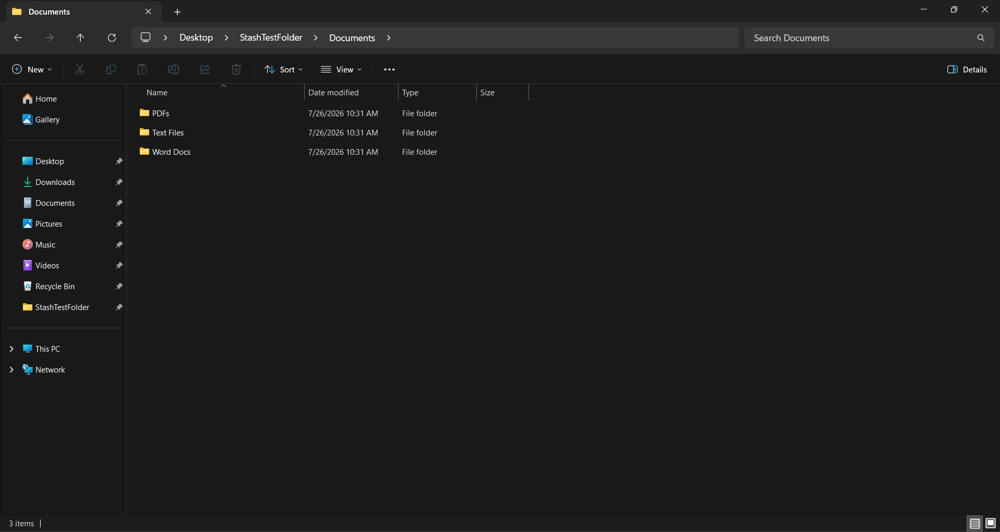 | 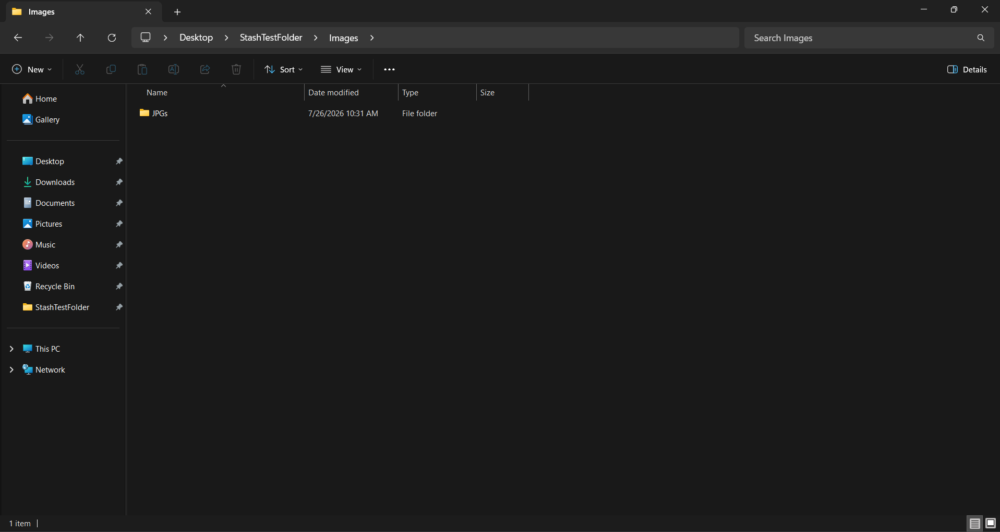 |  |

| Videos | Unknown (Others) | System Folder |
|--------|------------------|---------------|
|  | .png) | 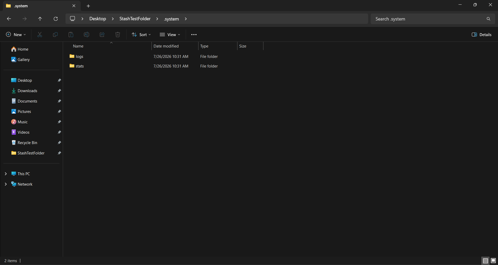 |

### Duplicate Handling

| Before Duplicate Run | Terminal — Duplicate Renaming | Duplicates Renamed | Duplicate Log |
|----------------------|------------------------------|--------------------|---------------|
| 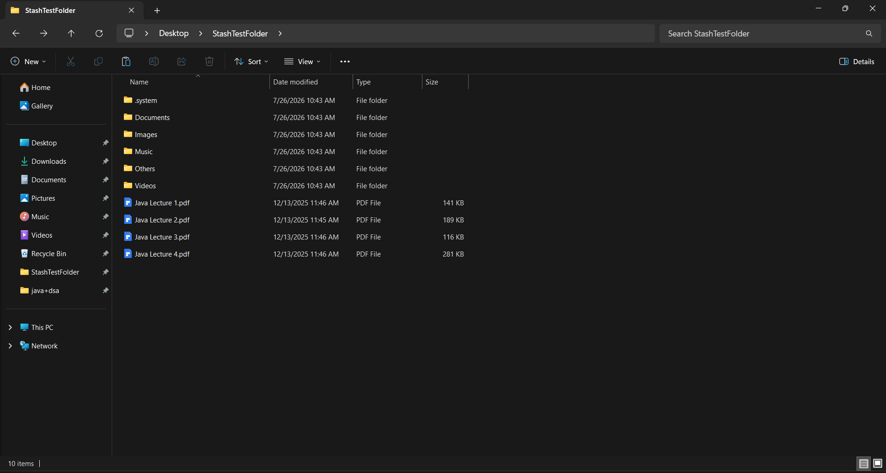 | 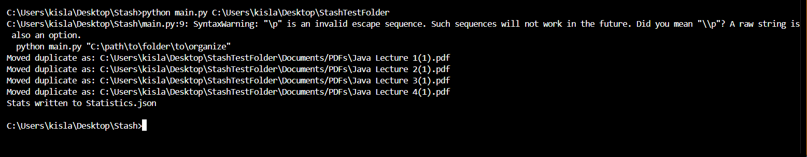 | 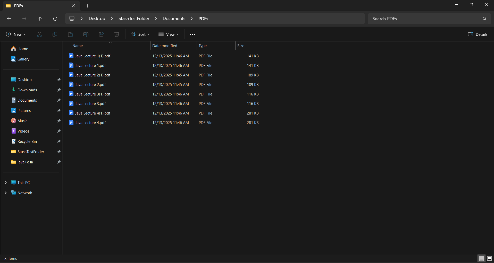 | 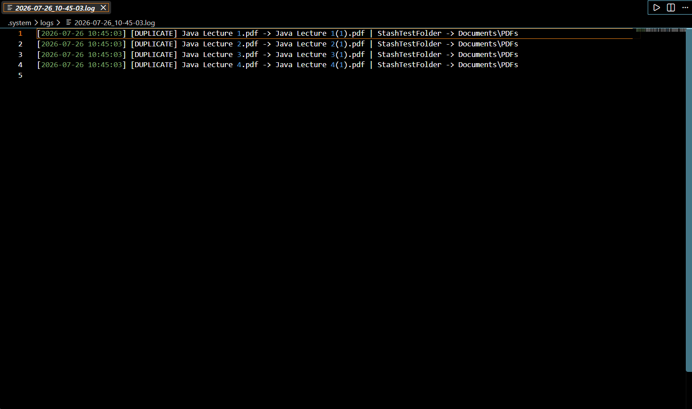 |

### Logs & Statistics

| File Move Log | Terminal Statistics | Statistics JSON |
|---------------|-------------------|-----------------|
| 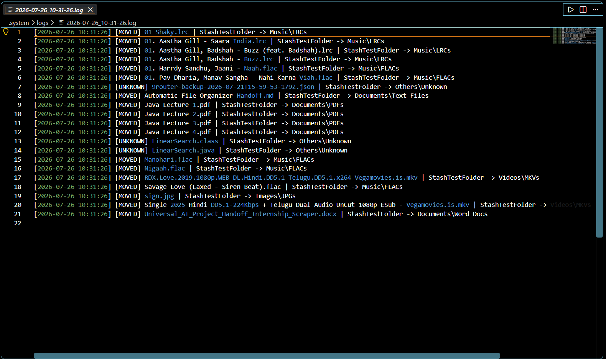 | 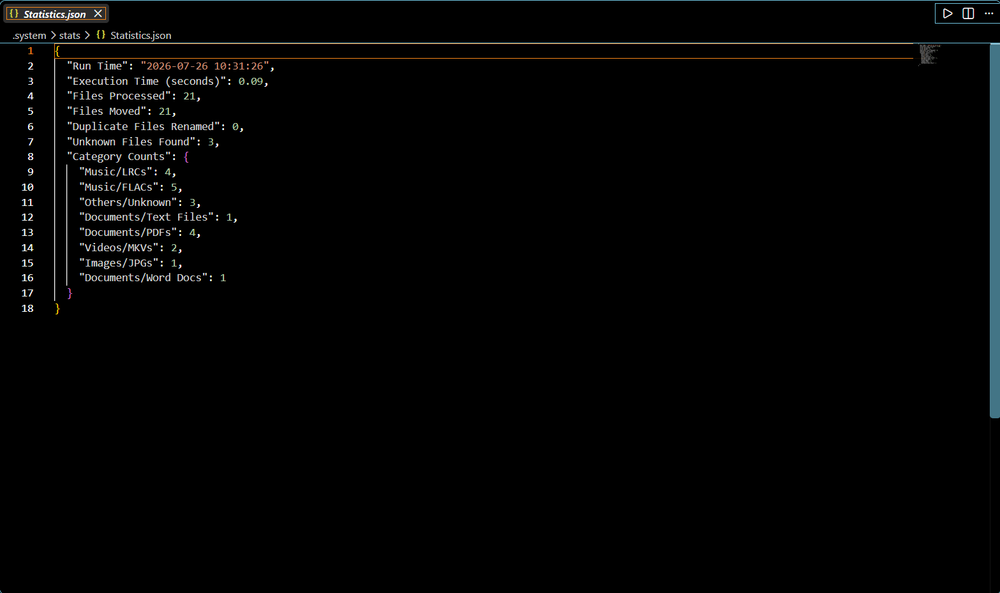 | 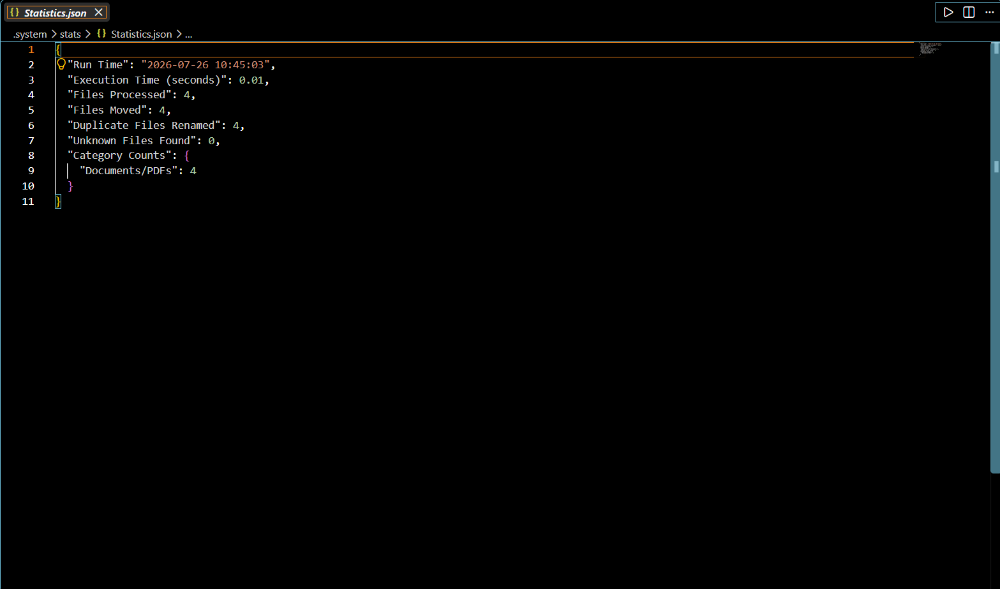 |

---

## License

Personal project.
